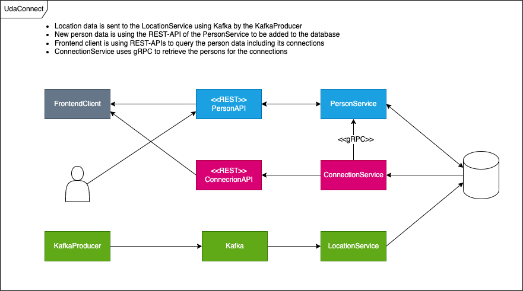

# UdaConnect Project André Füchsel 

## Architectural Design decisions

### Target architecture

Breaking down the monolith into microservices brings us to the following target architecture: 

* _PersonService_ to handle all person related data. It provides a REST interface to create and retrieve _Person_ data. 
* _ConnectionService_ to compute all connections between _Person_ data using their _Location_ data. It accesses the _PersonService_ using gRPC. It also provides a REST interface to retrieve the _Connection_ data between different _Persons_. 
* _LocationService_ to store _Location_ data for _Person_. It is using Kafka for ingesting the _Location_ data that is generated by the _KafkaProducer_ simulating people's phones.  

### Justifying architectural decisions

1. We will use REST for all interfaces towards the _FrontendClient_ as REST is the standard way for communication using HTTP clients with their backend. We will provide a REST interface for _Person_ data and _Connection_ data, there is no need to also provide a REST interface for _Location_ data as it will not be displayed directly on the frontend (only as part of the _Connection_ data). 

2. New _Person_ data will also be added using the REST interface. 

3. The application should be able to handle large amount of _LocationData_. Additionaly the _LocationData_ must not get lost in case of service failures of the _LocationService_. Kafka provides support for large volume of data and is able to buffer the data in a queue so we will not loose any data. 

4. The _ConnectionService_ uses gRPC for communication with the _PersonService_ for two reasons: it is a purely internal, technical interface and it is fast due to it's binary representation. 

## Out of scope

While refactoring into several services one would normally also divide the database into different ones: one for each service. For simplicity and as this is only a showcase it has been decided to stick with just one datbase used by each service - but services are only allowed to access their very own tables. 

### Refactoring comments

It would have been useful fot the _ConnectionService_ to access also the _LocationData_ via gRPC. This the _LocationService_ would not need to access the database as well. But this turned out to be much more difficult then the gRPC interface to the _PersonService_ so I decided to not implement it. In a real production environment this would be needed. 

